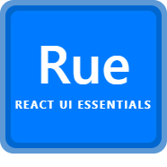

<p align="center">
  <a href="https://react-ui-essentials.vercel.app/" rel="noopener" target="_blank"></a>
</p>

<h1 align="center">React-ui-essentials</h1>

[React-ui-essentials](https://react-ui-essentials.vercel.app/) is an open-source React component library built with React. It's comprehensive and can be used in production out of the box.

## 📦 Installation

Install the package in your project directory.
Run any of the following commands.

```bash
# Using npm
npm i react-ui-essentials --save

# Using yarn
yarn add react-ui-essentials --save

# Using pnpm
pnpm add react-ui-essentials --save

# Using bun
bun add react-ui-essentials --save
```
 ## 👉 Getting set up
 To start using the components, please follow these steps:
 
```bash
import React from "react";
import ReactDOM from "react-dom/client";
import App from "./App.jsx";
import "react-ui-essentials/dist/index.css"; // once import styles in the main file

ReactDOM.createRoot(document.getElementById("root")).render(
  <React.StrictMode>
      <App />
  </React.StrictMode>
);
```
## Components

<table width="100%">
  <tr>
    <td>Accordion</td>
    <td>Alert</td>
    <td>Avatar</td>
    <td>Badge</td>
  </tr>
  <tr>
    <td>Banner</td>
    <td>Breadcrum</td>
    <td>Box</td>
    <td>Button</td>
  </tr>
  <tr>
    <td>Cards</td>
    <td>CloseButton</td>
    <td>ContentScrollable</td>
    <td>Drawer</td>
  </tr>
  <tr>
    <td>Dropdown</td>
    <td>Fieldset</td>
    <td>Figure</td>
    <td>Forms</td>
  </tr>
  <tr>
    <td>FullScreen Toggle</td>
    <td>Grid Background</td>
    <td>Grid System</td>
    <td>Guides</td>
  </tr>
  <tr>
    <td>Hooks</td>
    <td>Icons</td>
    <td>JsonViewer</td>
    <td>Link</td>
  </tr>
  <tr>
    <td>LinkBar</td>
    <td>Link Button</td>
    <td>Lists</td>
    <td>Model</td>
  </tr>
  <tr>
    <td>NonIdealState</td>
    <td>Popover</td>
    <td>Ripple</td>
    <td>SectionHeader</td>
  </tr>
  <tr>
    <td>State Management</td>
    <td>Spinner</td>
    <td>Splitters</td>
    <td>Stack</td>
  </tr>
  <tr>
    <td>Text Highlighter</td>
    <td>Table</td>
    <td>Tag</td>
    <td>Tabs</td>
  </tr>
  <tr>
    <td>Toast</td>
    <td>Typography</td>
    <td></td>
  </tr>
</table>


## 📃 Documentation
Visit [https://react-ui-essentials.vercel.app/](https://react-ui-essentials.vercel.app/) to view the full documentation.

## 📖 Examples
Our documentation features [a collection of example projects using React-ui-essentials](https://react-ui-essentials.vercel.app/allComponents).

## 🪪 License
This project is licensed under the terms of the
[MIT license](/LICENSE).